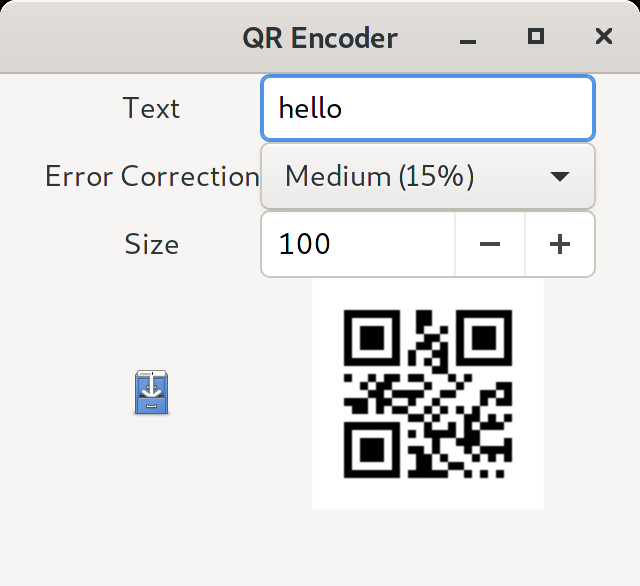

QR Encoder
======================

This is a [Rust] application that displays a [QR code] from text.

<https://gitlab.com/claudiomattera/rust-qr-encoder/>

Installation
----

Executables for Linux can be found in the [releases page](https://gitlab.com/claudiomattera/rust-qr-encoder/-/releases).

### From source

This application can be compiled using the Rust toolchain.

~~~~shell
cargo build --release
~~~~

The resulting executable will be created in `target/release/rust-qr-encoder`.

Usage
----

A QR code is automatically generated whenever some text is typed or pasted into the text field.
The error correction level and the size of the QR code image can also be selected in the main window.

License
----

Copyright Claudio Mattera 2020

You are free to copy, modify, and distribute this application with attribution under the terms of the [MIT license]. See the [`License.txt`](./License.txt) file for details.

[Rust]: https://rust-lang.org/
[QR code]: https://en.wikipedia.org/wiki/QR_code
[MIT license]: https://opensource.org/licenses/MIT
